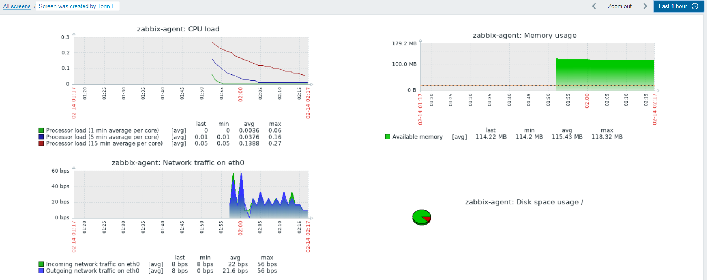

### Установка Zabbix-server 4.0 + web

[Инструкция][1]

Есть инструкция, что еще нужно?

Начну не с начала.

Инструкция пошаговая, понятная. Решил сразу писать сценарий в Ansible.

Попоутно встрелил несколько не плохих вариантов, [роли][2] и из [галактики][3].

Причин не использовать их для себя нашел несколько:

- чужой код, для проверки которого у меня нет достаточного опыта
- ни разу не устанавливал Zabbix-server с нуля
- практика самомтоятельного написания сценариев Ansible

Накидав примерный сценарий, я его запустил, и первой ошибкой была синтаксическая в Vagrantfile - именя узлов должны быть без тире - либо в ковычках ''.

```
Message: NameError: undefined local variable or method `server' for main:Object
```

Вторая - зависимости.
```bash
Processing Dependency: libiksemel.so.3()(64bit) for package: zabbix-server-mysql-4.0.4-1.el7.x86_64
```

Я ее бы не встретил, да как и последующие, вполнив команду из инструкции:
```bash
rpm -ivh https://repo.zabbix.com/zabbix/4.0/rhel/7/x86_64/zabbix-release-4.0-1.el7.noarch.rpm
```

Нужно добавить 2 ссылки в репозиторий - я сделал через 2 репозитория.
```bash
https://repo.zabbix.com/zabbix/4.0/rhel/7/x86_64/
http://repo.zabbix.com/non-supported/rhel/7/x86_64/
```

И ошибка с ключами gpgkey, которую можно было решить просто отключением их проверки.
Я не понял как это следать с помощью Ansible модуля, поэтому просто скопировал ключи в файлы и копирую из при создании репозитория.
```bash
/etc/pki/rpm-gpg/RPM-GPG-KEY-ZABBIX
/etc/pki/rpm-gpg/RPM-GPG-KEY-ZABBIX-A14FE591
```

**Вопрос: Есть идеи, как сделать репозитарий модулем yum_repository без ручного копирования gpgkey ключей?**

Дальше идет попытка создать базу.
Сразу не хватает пакета MySQL-python.

Суть в чем, по инструкции предполпгплось, что база уже стоит. А у нас ее нет.
Есть [такая][4] инструкция, тут установка базы есть. 

А [тут][5] я даже накопировал шаги сценария для установки базы.
С установкой базы проблем нет. А вот попасть в нее ни ни Ansible - не смогли.

Тут все объясняется [тут][6] - пароль пустой.
```bash
In order to log into MariaDB to secure it, we'll need the current password for the root user. 
If you've just installed MariaDB, and you haven't set the root password yet, 
the password will be blank, so you should just press enter here.
```

Нужно передать пустой пароль в скрипт. 
Так как [тут][5] и [тут][8] подключение идет через файл - `~/.my.cnf` - сделал так же только через шаблон.
Почему? Потому что не знал как передать пустой пароль. На мысль натолкнуло [это][7]
```yaml
"{{ some_var_name | default() }}"
```

В итоге - первы раз с этим модулем, нужно подробнее рассмотреть.
```yaml
- name: Create a new database for Zabbix with name 'zabbix'
  mysql_db:
    name: zabbix                                    # Имя базы данных
    config_file: ~/.my.cnf                          # Файл с именем пользователя и паролем - для создания использую root
    #login_user: root                               # Можно указать явно - не черз файл, но у меня не пошло
    #login_password: "{{ mysql_root_password }}"    #
    encoding: utf8                                  # Кодировка
    collation: utf8_bin                             # Тип оптимизации для данной кодировки
    state: present                                  #
```

Следующий шаг - [права для пользователя][10]. Тут на самом деле его создаем с правами. Еще не фак что заработает, опция `host_all` при создании пользователя не доступна.
Может придется отдельно добавлять права входа с localhost.
```yaml
- name: Give rights user for database Zabbix
  mysql_user:
    name: zabbix
```

Эти команды даже отработали без проблем. А вот с копирование схем таблиц БД - пока беда.
Нужно схему распаковать. А для модуля unarchive нужна программа unzip и gtar. Ставлю. Но это не помогает.

Такая ошибка. Решния не нашел.
```bash
TASK [Extract /usr/share/doc/zabbix-server-mysql-4.0.4/create.sql.gz into /usr/share/doc/zabbix-server-mysql-4.0.4/] ***
fatal: [zabbix-server]: FAILED! => {"changed": false, "msg": "Failed to find handler for \"/usr/share/doc/zabbix-server-mysql-4.0.4/create.sql.gz\". Make sure the required command to extract the file is installed. Command \"/bin/gtar\" could not handle archive. Command \"/bin/unzip\" could not handle archive."}
        to retry, use: --limit @/vagrant/playbook-server.retry
```

Шаг вызлядит так пробовал с `remote_src: yes` и без.
```yaml
unarchive:
  src: /usr/share/doc/zabbix-server-mysql-4.0.4/create.sql.gz
  dest: /tmp/
  remote_src: yes
```

**Вопрос: Где у меня тут ошибка и почему не заработал unarchive?**

Дальше приходится пользоваться обходным путем - shell. И все, проблемы нет.

Дальше по [инструкции][4] настройка zabbix-сервера. Тут использую lineinfile и вспоминаю [словари в цикле][9].
```bash
with_items:
  - { regexp: '^DBHost=', line: 'DBHost=localhost' }
```

Дальше проблемы при запуске zabbix
```bash
 17060:20190211:210052.460 cannot start alert manager service: Cannot bind socket to "/var/run/zabbix/zabbix_server_alerter.sock": [13] Permission denied.
```

Интернет дружно говорит - отключать selinux. 
Но сначала предлагаю помучаться с ним.

[Тут][11] предлагается на основе логов блокировки создать правило и применить.
А [тут][12] - если программы audit2allow не работает и не устанавливается.

```bash
[root@zabbix-server vagrant]# yum provides audit2allow
[root@zabbix-server vagrant]# yum install policycoreutils-python
[root@zabbix-server vagrant]# cat /var/log/audit/audit.log | grep zabbix_server  | grep denied | audit2allow -M zabbix_server_setrlimit
[root@zabbix-server vagrant]# semodule -i zabbix_server_setrlimit.pp
Killed
```

На первй взгляд не помогло.
```bash
type=AVC msg=audit(1550001278.834:2050): avc:  denied  { create } for  pid=13851 comm="zabbix_server" name="zabbix_server_preprocessing.sock" scontext=system_u:system_r:zabbix_t:s0 tcontext=system_u:object_r:zabbix_var_run_t:s0 tclass=sock_file permissive=0
type=AVC msg=audit(1550001278.835:2051): avc:  denied  { create } for  pid=13850 comm="zabbix_server" name="zabbix_server_alerter.sock" scontext=system_u:system_r:zabbix_t:s0 tcontext=system_u:object_r:zabbix_var_run_t:s0 tclass=sock_file permissive=0
```
[Тут][13] - еще одна инструкция. Скачивается политика и применяется.
```bash
curl https://support.zabbix.com/secure/attachment/53320/zabbix_server_add.te > zabbix_server_add.te
checkmodule -M -m -o zabbix_server_add.mod zabbix_server_add.te
semodule_package -m zabbix_server_add.mod -o zabbix_server_add.pp
semodule -i zabbix_server_add.pp
```
Не помогло.

Вот так выглядит результат после 5-10 минутного ожидания выполнения команды:
```bash
[root@zabbix-server ~]# semodule -i zabbix_server_setrlimit.pp
Killed
```
Не уверен что верный результат.

Но дабы убедиться, что дело именно в selinux - отключу и проверю.
```bash
[root@zabbix-server ~]# vi /etc/sysconfig/selinux
...
SELINUX=disabled
...
[root@zabbix-server ~]# setenforce 0
[root@zabbix-server vagrant]# systemctl restart zabbix-server
[root@zabbix-server vagrant]# tail -f /var/log/zabbix/zabbix_server.log 
```
Все, ошибки нет. Сервер запустился.
Значит я так и не научился настраивать selinux.

Тут я попросил помощи. Pavel K. любезно согласился и через 70 сообщений, zabbix-сервер заработал.
[Тут][14] не плохая статья о работе с selinux и немного про стандартные политики `getsebool -a`

**Вопрос: Как в список попадают новые программы/политики? Во время установки программ или как-то иначе?**

Что делали. Включали стандартные политики. Добавляли официальные - эту часть я уже пробовал отдельно.

В сценарии работа с selinux - все через ... shell модуль.

Нашел модуль отключения selinux только.

**Вопрос: Есть идеи, как заменить команды `checkmodule, semodule` в shell? Кроме curl конечно, с передачей файла проблем нет**

Добавил кучу шагов с проверками в сценарий.

```
...
Standart selinux zabbix-policy on
Check first policy was enabled
Notice! Selinux zabbix-policy was enabled
Add selinux zabbix-policy
Enable selinux zabbix-web policy
...
```

и на поверки завязан запуск демонов zabbix-server и httpd.
Может оно и криво. Да наверняка.
Если есть идеи по улучшению - я внимательно записываю.

Но идея проста, демон запускается в любом случае. Ошибок при старте нет. Но он без selinux - не работает. 
В логах либо есть ошибки, либо их нет.
Либо web подключается к серверу, либо нет. 
И я хотел добавить условия на запуск, чтоб только в случае работы selinux - все запускалось.

Ну и зврвботало, ошибок больше не было.

По ходу дела, смог обойти эту первоначальную ручную настройку в web из статьи [тут][15]

Скопировал преднастроенный файл - там кстати можно менять пароль базы для web.
```bash
/etc/zabbix/web/zabbix.conf.php
```

Считаю, сервер готов.

С агентом, думаю, особых проблем не будет, тем более у меня уже где-то был сценарий для его установки.
Все что нужно:
 - установка агента
 - правила ФВ - если агент в пассивном режиме
 - конфигурационный файл с указанием сервера

Но в сценарии много лишнего. Это и куча проверок на запущенность сервисов.
И настройка ФВ. И даже добавление нового хоста на сервер в web.
Пробую все это запустить.

Единственныйм удручающим моментом остается то, что разворасиваются 2 узла около 15ти минут.
Приходится ждать после каждой правки.

Потом то я догадался копировать инвентарный файл и сценарий на развернутый узел для отладки. Но не сразу.

Узел успешно добавлен.
```
zabbix-agent  Applications 10 Items 34  Triggers 15 Graphs 5  Discovery 2 Web 192.168.33.13: 10050  Template OS Linux (Template App Zabbix Agent) Enabled ...  
```

Осталось добавить картинку, которую можно было снять на работе за куда более короткий срок.
На это задание потребовалось 12:59:37, хотя я и сам себе его усложнил.


Format: 

---

[1]: https://www.zabbix.com/documentation/4.0/ru/manual/installation/install_from_packages/rhel_centos
[2]: https://github.com/dj-wasabi/ansible-zabbix-server
[3]: https://galaxy.ansible.com/dj-wasabi/zabbix-server
[4]: https://serveradmin.ru/ustanovka-i-nastroyka-zabbix-3-4-na-centos-7/
[5]: https://gist.github.com/vovanmix/0a2ea225692645ef770e
[6]: https://stackoverflow.com/questions/20270879/whats-the-default-password-of-mariadb-on-fedora
[7]: https://serverfault.com/questions/805576/how-to-assign-an-empty-value-to-a-variable-in-ansible
[8]: https://easyengine.io/tutorials/mysql/mycnf-preference
[9]: https://docs.ansible.com/ansible/2.4/playbooks_loops.html#standard-loops
[10]: https://docs.ansible.com/ansible/latest/modules/mysql_user_module.html
[11]: https://gita-dev.ru/blog/ustranenie-problem-s-zapuskom-zabbix-v-centos-71-problema-s-pravilami-selinux/
[12]: http://www.in1.lt/install-audit2allow-centos/
[13]: https://serveradmin.ru/ustanovka-i-nastroyka-zabbix-4-0/
[14]: https://www.dmosk.ru/miniinstruktions.php?mini=selinux-setting
[15]: http://sysads.co.uk/2014/01/04/change-zabbix-database-password/